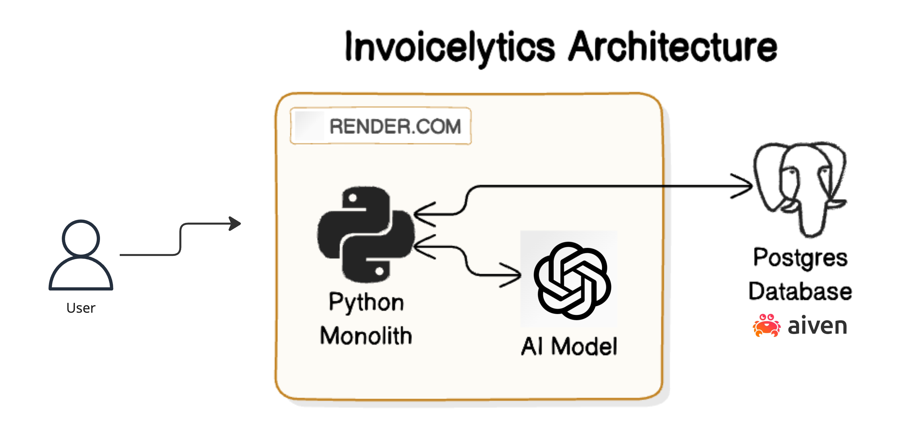
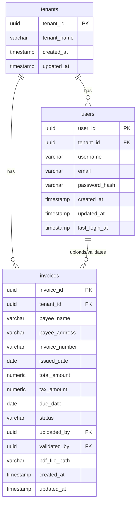

## Índice

0. [Ficha del proyecto](#0-ficha-del-proyecto)
1. [Descripción general del producto](#1-descripción-general-del-producto)
2. [Arquitectura del sistema](#2-arquitectura-del-sistema)
3. [Modelo de datos](#3-modelo-de-datos)
4. [Especificación de la API](#4-especificación-de-la-api)
5. [Historias de usuario](#5-historias-de-usuario)
6. [Tickets de trabajo](#6-tickets-de-trabajo)
7. [Pull requests](#7-pull-requests)

---

## 0. Ficha del proyecto

### **0.1. Tu nombre completo:**

Felipe Abrantes Carvalho

### **0.2. Nombre del proyecto:**

Invoicelytics

### **0.3. Descripción breve del proyecto:**

Invoicelytics is a product that is meant to make it much easier working with invoices. All you need to do is uploading invoices in PDF format into Invoicelytics. Once that's done, you can ask questions about the invoices, such as:
- how much have i spent in the last 30 days?
- how many invoices coming from company ABC have been uploaded?
- how much money is due to company ABC?

### **0.4. URL del proyecto:**

> Puede ser pública o privada, en cuyo caso deberás compartir los accesos de manera segura. Puedes enviarlos a [alvaro@lidr.co](mailto:alvaro@lidr.co) usando algún servicio como [onetimesecret](https://onetimesecret.com/).

https://invoicelytics.onrender.com

### 0.5. URL o archivo comprimido del repositorio

> Puedes tenerlo alojado en público o en privado, en cuyo caso deberás compartir los accesos de manera segura. Puedes enviarlos a [alvaro@lidr.co](mailto:alvaro@lidr.co) usando algún servicio como [onetimesecret](https://onetimesecret.com/). También puedes compartir por correo un archivo zip con el contenido

https://github.com/felipecao/invoicelytics

---

## 1. Descripción general del producto

> Describe en detalle los siguientes aspectos del producto:

### **1.1. Objetivo:**

> Propósito del producto. Qué valor aporta, qué soluciona, y para quién.

**Invoicelytics** is a cutting-edge invoice management platform designed to simplify and streamline the process of handling invoices. With Invoicelytics, you can easily upload your invoices in PDF format and leverage advanced analytics to gain actionable insights. Whether you're a small business owner, accountant, or finance manager, Invoicelytics empowers you to stay on top of your finances with ease.

The platform allows you to quickly answer critical questions like how much you've spent in the last 30 days, track invoices from specific companies, and monitor outstanding payments—all from a single, user-friendly interface. By automating invoice tracking and analysis, Invoicelytics eliminates manual errors, saves time, and provides a clear view of your financial health. It's the ideal solution for anyone looking to take control of their invoicing process, reduce administrative burdens, and make smarter financial decisions.

### **1.2. Características y funcionalidades principales:**

> Enumera y describe las características y funcionalidades específicas que tiene el producto para satisfacer las necesidades identificadas.

1. **Automated Invoice Upload and Processing**: Users can easily upload invoices in PDF format, and Invoicelytics automatically extracts and organizes the relevant data, eliminating the need for manual entry and reducing the risk of errors.

1. **Vendor Management and Tracking**: Invoicelytics enables users to manage and track invoices by vendor, making it easy to see how much money is due, which invoices have been paid, and which are still outstanding. This feature helps users maintain healthy vendor relationships and avoid missed payments.

1. **AI-Powered Chat Assistance**: Invoicelytics features an intelligent chat assistant that allows users to ask questions about their invoices using natural language. Whether you want to know your total expenses for the month, the number of invoices from a specific vendor, or outstanding payments, the AI assistant provides instant, accurate responses, making invoice management effortless.


### **1.3. Diseño y experiencia de usuario:**

> Proporciona imágenes y/o videotutorial mostrando la experiencia del usuario desde que aterriza en la aplicación, pasando por todas las funcionalidades principales.

[Videotutorial](https://vimeo.com/1009412330?share=copy)

### **1.4. Instrucciones de instalación:**
> Documenta de manera precisa las instrucciones para instalar y poner en marcha el proyecto en local (librerías, backend, frontend, servidor, base de datos, migraciones y semillas de datos, etc.)

See the `README.md` file contained in the codebase.

---

## 2. Arquitectura del Sistema

### **2.1. Diagrama de arquitectura:**
> Usa el formato que consideres más adecuado para representar los componentes principales de la aplicación y las tecnologías utilizadas. Explica si sigue algún patrón predefinido, justifica por qué se ha elegido esta arquitectura, y destaca los beneficios principales que aportan al proyecto y justifican su uso, así como sacrificios o déficits que implica.



Invoicelytics is a very early-stage product, with a very small team, composed of 1 person (myself), and I come from a backend engineering background.

As the product is still at a very insipient stage, the architecture focuses on simplicity. It's composed of 3 very basic elements:
- a monolith written in Python, which is the language I'm most proficient with among the allowed languages, and deployed for free on render.com
- a Postgres instance deployed on Aiven.io, a free Postgres service
- an AI model to enable user questions in natural language about the invoices uploaded into the platform

The main benefits of this architecture are as follows:
- **Low costs**: most cloud providers are free
- **Focuses on strengths**: with a strong backend engineering background, having a SPA would require investing significat amounts ot time and energy to have a codebase in a optimal state, which would be likely to extrapolate the amount of time available for this task. Instead, this architecture focuses on technologies I'm proficient with and that also intersect with what I use on daily work
- **Simple and easy to pivot**: a simple architecture focused on things I'm used to makes me more agile, enabling me to pivot if necessary and turn the product in a different direction.

Please notice that as part of this approach, there will be no Single Page App, written in React or any other frontend framework. As I'm not familiar with frontend technologies, the project will provide a Web UI written using Flask framework.

### **2.2. Descripción de componentes principales:**

> Describe los componentes más importantes, incluyendo la tecnología utilizada

#### 1. Python Monolith
**Technology**: Python

**Purpose**: The Python monolith serves as the core of the Invoicelytics application. It handles all the backend logic, processing invoice data, and managing user interactions. Python was chosen due to the developer's proficiency in the language, enabling rapid development and easy maintenance.

**Deployment**: The monolith is deployed on Render.com, a cloud platform that offers free hosting, which is ideal for this early-stage product.

#### 2. Postgres Database
**Technology**: PostgreSQL

**Purpose**: This is the primary database for storing all invoice-related data. It keeps track of uploaded invoices, vendor details, user queries, and any other data required by the application. PostgreSQL was chosen for its robustness and flexibility in handling relational data.

**Deployment**: The database is hosted on Aiven.io, which provides a free PostgreSQL instance, aligning with the goal of maintaining zero costs.

#### 3. AI Model
**Technology**: OpenAI GPT-4o model
**Purpose**: The GPT-4o model enables the natural language processing capabilities of the platform. Users can ask questions about their invoices in plain language, and the AI model interprets these queries, fetching and processing the relevant data to provide accurate responses.

**Deployment**: The AI model is provided by OpenAI and is available via HTTP calls.

### **2.3. Descripción de alto nivel del proyecto y estructura de ficheros**

> Representa la estructura del proyecto y explica brevemente el propósito de las carpetas principales, así como si obedece a algún 

See the `README.md` file contained in the codebase.

### **2.4. Infraestructura y despliegue**

> Detalla la infraestructura del proyecto, incluyendo un diagrama en el formato que creas conveniente, y explica el proceso de despliegue que se sigue

See section `2.1. Diagrama de arquitectura` above.

### **2.5. Seguridad**

> Enumera y describe las prácticas de seguridad principales que se han implementado en el proyecto, añadiendo ejemplos si procede

Given that **Invoicelytics** is an early-stage MVP, it's crucial to balance security practices with simplicity and resource constraints. Here are five security practices that are appropriate for this stage:

#### 1. Basic Authentication and Access Control
**Description**: Implement basic authentication (e.g., username and password) to ensure that only authorized users can access the system. Store passwords securely using strong hashing algorithms like bcrypt.
Reasoning: Even in an MVP, it's essential to ensure that unauthorized users cannot access the application, especially since it handles sensitive financial data.

#### 2. HTTPS/TLS for Data Transmission
**Description**: Ensure that all data transmitted between the user and the server is encrypted using HTTPS/TLS. This can be easily implemented on Render.com, which typically provides free SSL certificates.
Reasoning: Encrypting data in transit prevents potential attackers from intercepting sensitive information, such as invoice details or login credentials.

#### 3. Secure Database Configuration
**Description**: Implement basic security configurations for the PostgreSQL database, such as using strong, unique passwords for database access, restricting database access to only necessary services, and ensuring that the database is not exposed to the public internet.
Reasoning: Securing the database is critical to protect stored invoice data from unauthorized access or breaches.

### **2.6. Tests**

> Describe brevemente algunos de los tests realizados

#### 1. PDF Invoice Upload and Data Extraction Test
**Purpose**: To ensure that the system correctly handles the upload of PDF invoices and accurately extracts the relevant data.

**Test Description**:
- Upload a variety of PDF invoices with different formats, layouts, and data points.
- Verify that the system accurately extracts key information such as invoice number, date, vendor name, total amount, and line items.
- Test edge cases, such as poorly scanned PDFs or invoices with uncommon formats, to see how the system handles them.
- Ensure that extracted data is correctly stored in the database for later use.

**Expected Outcome**: The system should consistently extract and organize the data correctly, regardless of the PDF format variations.

#### 2. Vendor Management and Tracking Functionality Test
**Purpose**: To verify that the system correctly categorizes and tracks invoices by vendor, and provides accurate reporting.

**Test Description**:
- Upload invoices from multiple vendors and check that the system correctly associates each invoice with the correct vendor.
- Query the system for all invoices from a specific vendor and verify that the list is accurate and complete.

**Expected Outcome**: The system should accurately track and report on invoices by vendor, correctly calculating outstanding amounts and providing reliable vendor-specific data.

#### 3. AI-Powered Chat Assistance Query Accuracy Test
**Purpose**: To ensure that the AI assistant correctly interprets and responds to user queries about invoices.

**Test Description**:
- Ask a variety of natural language questions, such as "How much did I spend last month?" or "Show me unpaid invoices from vendor ABC."
- Verify that the AI provides accurate and relevant responses based on the data in the system.
- Test the AI's ability to handle ambiguous or complex queries, as well as its response to unexpected or invalid questions.
- Check the AI's performance with both simple and compound queries (e.g., "How much is due to vendor ABC and when is the payment due?").

**Expected Outcome**: The AI assistant should accurately understand and respond to a wide range of user queries, providing reliable information based on the uploaded invoices.

---

## 3. Modelo de Datos

### **3.1. Diagrama del modelo de datos:**

> Recomendamos usar mermaid para el modelo de datos, y utilizar todos los parámetros que permite la sintaxis para dar el máximo detalle, por ejemplo las claves primarias y foráneas.




### **3.2. Descripción de entidades principales:**

> Recuerda incluir el máximo detalle de cada entidad, como el nombre y tipo de cada atributo, descripción breve si procede, claves primarias y foráneas, relaciones y tipo de relación, restricciones (unique, not null…), etc.

---

- **tenants Table**:
  - `tenant_id` is a UUID primary key, **not null**.
  - `tenant_name` is a varchar field to store the name of the tenant, **not null** and **unique** within the table.
  - `created_at` and `updated_at` are timestamp fields for tracking creation and last modification times, both **not null**.

- **users Table**:
  - `user_id` is a UUID primary key, **not null**.
  - `tenant_id` is a foreign key (UUID) linking to the `tenants` table, **not null**.
  - `username` is a varchar field for storing the username, **not null** and **unique** within the tenant.
  - `email` is a varchar field for storing the user’s email, **not null** and **unique** within the tenant.
  - `password_hash` is a varchar field for storing the user’s password hash, **not null**.
  - `created_at`, `updated_at`, and `last_login_at` are timestamp fields for tracking user activity, all **not null**.

- **invoices Table**:
  - `invoice_id` is a UUID primary key, **not null**.
  - `tenant_id` is a foreign key (UUID) linking to the `tenants` table, **nullable**.
  - `payee_name` is a varchar field for storing the payee's name, **nullable**.
  - `payee_address` is a varchar field for storing the payee's address, **nullable**.
  - `invoice_number` is a varchar field for storing the invoice number, **nullable** and **unique** within the tenant.
  - `issued_date` and `due_date` are date fields for storing the invoice issuance and due dates, both **nullable**.
  - `total_amount` and `tax_amount` are numeric fields for storing the invoice amounts, both **nullable**.
  - `status` is a varchar field with allowed values ('created', 'processed', 'validated'), **nullable**.
  - `uploaded_by` is a foreign key (UUID) linking to the `users` table, **not nullable**.
  - `validated_by` is a foreign key (UUID) linking to the `users` table, **nullable**.
  - `pdf_file_path` is a varchar field for storing the file path of the uploaded PDF, **not nullable**.
  - `created_at` and `updated_at` are automatic timestamp fields for tracking the invoice lifecycle, both **not nullable**.

### Key Points:
- **Primary Keys**: All primary keys (`tenant_id`, `user_id`, `invoice_id`) are **not null**.
- **Unique Constraints**: 
  - `tenant_name` in the `tenants` table must be unique.
  - `username` and `email` must be unique within a tenant in the `users` table.
  - `invoice_number` must be unique within a tenant in the `invoices` table.

### 4. Especificación de la API

> Si tu backend se comunica a través de API, describe los endpoints principales (máximo 3) en formato OpenAPI. Opcionalmente puedes añadir un ejemplo de petición y de respuesta para mayor claridad

#### Get Invoices
   - **Endpoint**: `GET /api/invoices`
   - **Description**: This endpoint retrieves a list of all invoices associated with the authenticated user’s tenant. It can support filtering by status, date range, or payee.
   - **Query Parameters** (optional):
     - `status`: Filter by invoice status (e.g., `created`, `processed`, `validated`).
     - `start_date`: Filter by issued date range start.
     - `end_date`: Filter by issued date range end.
     - `payee`: Filter by payee name.
   - **Response**:
     ```json
     [
       {
         "invoice_id": "uuid",
         "payee_name": "Company ABC",
         "invoice_number": "INV-001",
         "issued_date": "2023-07-15",
         "total_amount": 1500.00,
         "status": "validated"
       },
       ...
     ]
     ```

#### Validate Invoice Data
   - **Endpoint**: `PUT /api/invoices/{invoice_id}/validate`
   - **Description**: This endpoint allows a user to validate the data extracted from an invoice and mark it as validated. The user can make corrections to the data if necessary before validation.
   - **Path Parameters**:
     - `invoice_id`: The UUID of the invoice to validate.
   - **Request Body**:
     ```json
     {
       "payee_name": "Company ABC",
       "invoice_number": "INV-001",
       "issued_date": "2023-07-15",
       "total_amount": 1500.00,
       "tax_amount": 150.00,
       "due_date": "2023-08-15",
       "status": "validated"
     }
     ```
   - **Response**:
     ```json
     {
       "message": "Invoice validated successfully.",
       "invoice_id": "uuid"
     }
     ```

#### Ask Invoice Query
   - **Endpoint**: `POST /api/invoices/query`
   - **Description**: This endpoint allows users to ask natural language questions related to their invoices (e.g., "How much did I spend last month?"). The AI model processes the query and returns a response.
   - **Request Body**:
     ```json
     {
       "query": "How much did I spend last month?"
     }
     ```
   - **Response**:
     ```json
     {
       "answer": "You spent $5,000 in July 2023.",
       "details": {
         "total_amount": 5000.00,
         "date_range": "2023-07-01 to 2023-07-31"
       }
     }
     ```

---

## 5. Historias de Usuario

> Documenta 3 de las historias de usuario principales utilizadas durante el desarrollo, teniendo en cuenta las buenas prácticas de producto al respecto.

#### Upload Invoice
- **Story**: As a **user**, I want to **upload an invoice as a PDF**, so that **the system can automatically extract and store the invoice details**.
- **Acceptance Criteria**:
  - The user must be able to upload a PDF file through the API.
  - The system extracts key invoice details (payee, amount, date, etc.) and stores them in the database.
  - The uploaded invoice is associated only with the user's tenant and cannot be accessed by users from other tenants.

#### Validate Invoice Data
- **Story**: As a **user**, I want to **validate and correct extracted invoice data**, so that **I can ensure the information is accurate before finalizing the invoice**.
- **Acceptance Criteria**:
  - The user can make corrections to the invoice data and submit the changes.
  - The invoice status is updated to "validated" once the user confirms the data.
  - The user must only be able to retrieve, view, and edit invoices that belong to their own tenant. Invoices from other tenants should not be accessible.

#### Ask Invoice Query via AI
- **Story**: As a **user**, I want to **ask natural language questions about my invoices**, so that **I can quickly get insights without manually searching through data**.
- **Acceptance Criteria**:
  - The user can submit a query in natural language through the API.
  - The system processes the query and returns a relevant, accurate response.
  - The AI must only provide information and insights related to invoices within the user's tenant. Data from other tenants should not be accessible or included in the response.

---

## 6. Tickets de Trabajo

> Documenta 3 de los tickets de trabajo principales del desarrollo, uno de backend, uno de frontend, y uno de bases de datos. Da todo el detalle requerido para desarrollar la tarea de inicio a fin teniendo en cuenta las buenas prácticas al respecto. 

#### Database Schema Design
   - **Ticket**: Design and implement the database schema for storing invoice data.
   - **Description**: Create the necessary tables, columns, and constraints in the PostgreSQL database to support invoice storage. This includes the `invoices` table and related fields such as `tenant_id`, `payee_name`, `invoice_number`, `pdf_file_path`, etc.
   - **Type**: SQL
   - **Dependencies**: None
   - **Acceptance Criteria**:
     - The database schema includes all required fields for storing invoice data.
     - The schema enforces tenant isolation through the `tenant_id` foreign key.
     - Constraints (e.g., primary keys, unique keys) are correctly applied.

#### Backend: API Endpoint for Invoice Upload
   - **Ticket**: Implement the API endpoint for uploading invoices.
   - **Description**: Develop the backend logic to handle PDF uploads, process the files, extract relevant data, and store the data in the database.
   - **Type**: Backend code (Python)
   - **Dependencies**: Database Schema Design
   - **Acceptance Criteria**:
     - The API endpoint accepts PDF files and extracts invoice data.
     - The extracted data is correctly saved to the database.
     - The API returns a confirmation response with the invoice ID and status.
     - Ensure tenant isolation: uploaded invoices are associated with the correct tenant.

#### Backend: PDF Processing and Data Extraction
   - **Ticket**: Implement the service for processing PDFs and extracting invoice data.
   - **Description**: Develop a backend service that takes a PDF as input, parses the document, and extracts key data points such as payee name, invoice number, total amount, etc.
   - **Type**: Backend code (Python)
   - **Dependencies**: API Endpoint for Invoice Upload
   - **Acceptance Criteria**:
     - The service accurately extracts data from a variety of invoice formats.
     - The extracted data includes all required fields (payee name, amount, dates, etc.).
     - The service handles errors gracefully, providing useful feedback if extraction fails.


---

## 7. Pull Requests

> Documenta 3 de las Pull Requests realizadas durante la ejecución del proyecto

**Pull Request 1**

**Pull Request 2**

**Pull Request 3**

